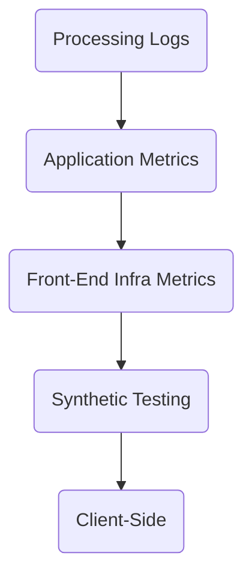

# Levels of SLI
With every [[Metrics]] you can further clarify what is a valid and good event. Where the metric is taken from is also extremmly important.

### Levels Flow Chart
From furthest to closest level to user to record metrics at:

#### Processing Logs
-  Backfil SLO and SLI data
- write code into logs -> Engineering Effort -> Latency -> No Emergency 
- can track multi-user jouney 
- If request don't make it no log

#### Application Metrics
- Same request promblem
- can't track multi-user journey
- write code for metrics -> Engineering Effort -> low Latency

#### Front-end infra metrics
- Few request will be missed
- detailed metrics -> Little to no Effort
- Not stateless
-  Depedent on meta data
- Can't figure out if request or resp is bad

#### Synthetic Testing
- Evolves into end-to-end
- Can't predict all ways a user will use a product

#### Client-side intrumentation
- Most acurrate SLI
- Really bad latency
- Frequest reporting could add mistrust to user and load on mobile