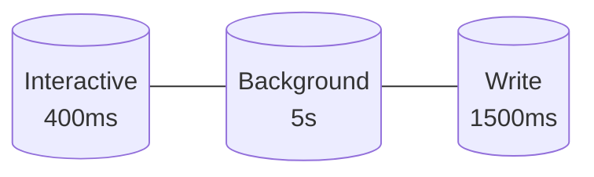
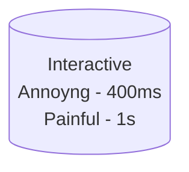

# Managing Complexity
Large systems will have large amounts of [[3-SLI]],  but it's best to keep in mind the quantity of SLI's, as they can:

- Add noise
- Add cognitive strain on ops
- And generally not all SLI are good (quality > quantity)

### Way To Simplify SLI
Simple aggregation works fine, but keep in mind:

- Aggregation treats all data the same (solved by using weights)
- Can hide low-traffic data from high-traffic ones

Bucketing is also another way to manage data, providing consensus across platform and clarity. This can be done by:

- Setting a threshold that does not negatively effect user journey across the board
- Genral bucketing could work like this:

We can also bucket multiple threshold points to signify the quality of service triggered such as:

